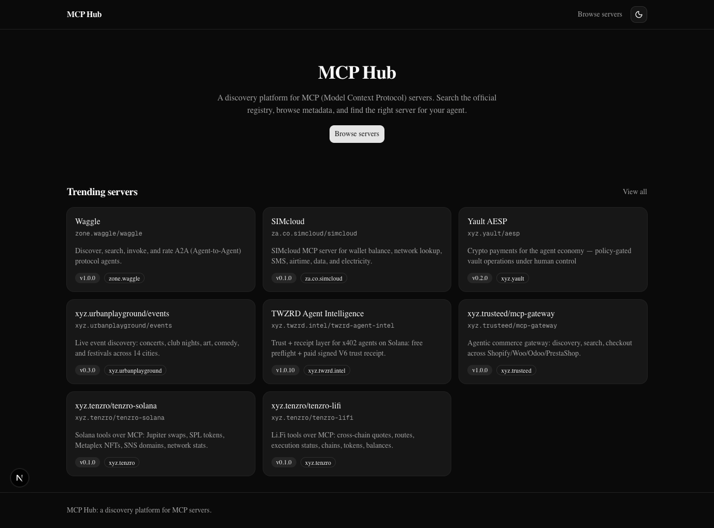

# MCP Hub

A discovery platform for MCP (Model Context Protocol) servers. It syncs from the official registry into Postgres and exposes a search/browse API and a Next.js UI over that data.



This is early. The backend, registry sync, and frontend (search, browse, server detail) work end to end. GitHub login, star ratings, written reviews, and compatibility/benchmark data are all live.

## Stack

- Backend: FastAPI, SQLModel/SQLAlchemy (async), Postgres via asyncpg
- Frontend: Next.js (App Router), TypeScript, Tailwind, shadcn/ui
- Redis and Celery are dependencies and Redis runs in Compose, but nothing in the code uses either yet
- Docker Compose for Postgres, Redis, the backend, and the frontend locally

## Setup

```bash
cp .env.example .env
docker compose up
```

Frontend: `http://localhost:3000` (or whatever port you set `FRONTEND_PORT` to). API docs: `http://localhost:8000/docs` (or `API_PORT`).

A `Makefile` wraps the common commands. Run `make help` for the full list (`dev`, `test`, `lint`, `db-reset`, `sync-registry`, `frontend-dev`, ...).

### Running the backend without Docker

Needs Python 3.14+.

```bash
cd backend && python -m venv .venv && source .venv/bin/activate && cd ..

make install
docker compose up -d postgres redis
make db-init
make run
```

### Running the frontend without Docker

Needs Node 22+ and the backend reachable (either via `docker compose up -d backend postgres redis`, or `make run` above).

```bash
cp frontend/.env.example frontend/.env.local
make frontend-install
make frontend-dev
```

The frontend fetches the backend directly from Server Components at request time - there's no API proxy layer, and no client-side code ever calls the backend (nothing in a `"use client"` file imports the data layer). `BACKEND_INTERNAL_URL` is server-only and never reaches the browser.

## Syncing the registry

```bash
make sync-registry
```

This walks every page of the official registry and upserts each server into Postgres, keeping only the latest version when the registry lists more than one. It retries on timeouts and 429s (honoring `Retry-After`), and paces requests to avoid the registry's rate limit. Against the real registry that's currently ~16,700 servers, so a full sync takes fifteen to twenty minutes, mostly waiting on Postgres round trips (see TODO.md).

It's admin-only: `.env.example` ships a placeholder `ADMIN_API_KEY`, sent back as an `X-Admin-Token` header via `make sync-registry`. Change it before running this anywhere that isn't your own machine. With no key configured at all, the endpoint refuses everyone with a 503 rather than staying open.

## Recording compatibility and benchmark results

Nothing in this app actually runs an MCP server to test it - `Compatibility` and `TestResult` are admin-submitted records of results produced elsewhere (manually, or by a separate test-runner). Same `X-Admin-Token` as above:

```bash
curl -X POST http://localhost:$API_PORT/api/v1/servers/<namespace>/compatibility \
  -H "X-Admin-Token: $ADMIN_API_KEY" -H "Content-Type: application/json" \
  -d '{"client":"claude","compatible":true}'

curl -X POST http://localhost:$API_PORT/api/v1/servers/<namespace>/test-results \
  -H "X-Admin-Token: $ADMIN_API_KEY" -H "Content-Type: application/json" \
  -d '{"version":"1.0.0","speed_ms":120,"memory_mb":64,"success_rate":0.95,"error_count":1}'
```

Compatibility is an upsert - one row per server/client, re-testing replaces the previous result. Test results are historical - each call appends a new row, and the server detail page shows the 5 most recent per server. `client` is limited to `claude`, `cursor`, or `vscode`, matching the frontend's compatibility matrix.

## Tests

```bash
docker compose up -d postgres redis
make test
```

Tests run against those same containers, but not against your dev data. `backend/tests/conftest.py` points `DATABASE_URL` at a separate `<db>_test` database (created automatically on first run) and resets its tables before and after every test, so order doesn't matter and your dev database - including anything pulled in via `make sync-registry` - is never touched.

The frontend has no test suite yet, just `make frontend-lint` and `cd frontend && npm run build` as a static-correctness gate (type errors, mainly).

## Auth

Ratings and reviews require logging in with GitHub. To enable it locally:

1. Register an OAuth App at [github.com/settings/developers](https://github.com/settings/developers). The **Authorization callback URL** must exactly match `GITHUB_REDIRECT_URI` in your `.env`, including the port - e.g. `http://localhost:8000/api/v1/auth/github/callback` if you're using the default `API_PORT`.
2. Put the app's client ID and secret in `.env` as `GITHUB_CLIENT_ID` / `GITHUB_CLIENT_SECRET`.
3. Restart the backend. "Log in with GitHub" in the header will now complete a real login instead of failing.

The session is a JWT in an httpOnly cookie, minted by the backend after the GitHub OAuth handshake. Login, callback, and logout are plain top-level redirects (not fetch calls), so they don't need `BACKEND_INTERNAL_URL` - the frontend uses a separate, intentionally public `NEXT_PUBLIC_BACKEND_URL` just for those links.

## Not built yet

- An actual test-execution engine - compatibility/benchmark results are admin-submitted, nothing here runs an MCP server to produce them
- Rate-limiting or content moderation on ratings/reviews
- JWT refresh - sessions hard-expire after 30 days
